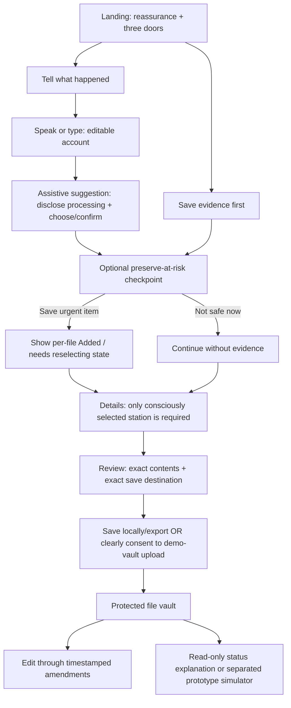

# Saakshi design-principles conformance audit and winning-solution plan

## Executive verdict

**Saakshi’s entry experience is coherent and unusually thoughtful. Its save, verification, evidence-retention, and dashboard behaviours are not yet uniformly aligned with the same promise.**

The app consistently says that the person stays in control of their words, details, and file. That is visibly true at entry: multiple starting points, editable narrative, optional evidence, review before saving, easy exit, and repeated prototype boundaries. It becomes unreliable at several consequential points where the interface either makes a decision on behalf of the person, labels a state more optimistically than it is, or makes a real-looking change under a “Demo” banner.

The winning solution is not to add more form fields or hide more warnings. It is to make each consequential moment answer three questions plainly:

1. **What exactly will happen if I continue?**
2. **What exactly is included, selected, saved, or changed?**
3. **Can I correct, defer, or recover from it?**

The resulting north-star principle is:

> **Preserve control before progress: never imply that something is saved, sent, selected, verified, or updated until the person can see its exact destination, contents, and consequence.**

## Scope, method, and limits

This is a combined UX, trust, and accessibility-oriented conformance audit of the public Saakshi prototype and its current source. It was performed on 3 September 2026 by independent parallel reviews of:

- filing flow, state machine, evidence, categorisation, and draft handling;
- dashboard, editing, status, Help, crisis, and shared chrome;
- theme, localisation, responsive, semantic, and feedback patterns; and
- a safe live visual check of landing, evidence-first, How it works, Help, and dashboard verification.

The live check did **not** enter a phone number, request an OTP, start recording, grant microphone/location access, upload a file, save a case, open a saved case, or modify public data. It validates only the visible states captured below—not data security, a full accessibility conformance claim, or real emergency-service behaviour.

| Current visual evidence | Surface checked |
| --- | --- |
| `docs/principle-audit-evidence-2026-09-03/00-landing-current.jpg` | Landing hierarchy, entry doors, prototype boundary, exit |
| `docs/principle-audit-evidence-2026-09-03/01-workflow-current.jpg` | How it works expectation setting |
| `docs/principle-audit-evidence-2026-09-03/02-help-current.jpg` | Help, prototype limits, leave and support copy |
| `docs/principle-audit-evidence-2026-09-03/03-dashboard-verify-current.jpg` | Verification gate and demo framing |
| `docs/principle-audit-evidence-2026-09-03/04-evidence-first-current.jpg` | Evidence order, optionality, reasons, skip state |

## Principles being validated

1. **Agency before automation** — the person owns their words and every consequential choice.
2. **Progress without pressure** — missing information does not become a failure; the smallest useful next step is clear.
3. **Safety is always adjacent** — exit and real-world support remain available without being confused with product completion.
4. **Evidence is explained, not merely requested** — prompts name their practical value and preserve an honest record of what exists.
5. **Honest boundaries build trust** — prototype, storage, verification, and communication limits are accurate at the moment they matter.
6. **A file stays living and legible** — a person can return, understand, amend, and recover their own record.

## Conformance matrix

Status: **Pass** means the principle is supported as designed. **Intentional exception** means the deviation has a defensible product reason. **Gap** means the implementation contradicts, weakens, or leaves the principle unproven. **Needs validation** means source or screenshots cannot safely answer the question.

| Principle | Entry and account | Evidence and details | Preview and verification | Dashboard and post-save | Help, crisis, language, theme |
| --- | --- | --- | --- | --- | --- |
| Agency before automation | **Pass.** Three self-selected doors; Speak/Type converge to editable words; Start over asks before clearing. | **Gap.** A station can be auto-selected before the person chooses it. | **Pass.** Review has a direct route back to edit. | **Mixed.** Edit plus edit-preview support ownership; status arrows let a person mutate authoritative-looking progress and edits overwrite prior fields without a revision trail. | **Gap.** Crisis choices clear the draft; there is no “keep this and return later.” |
| Progress without pressure | **Pass.** No timer; learn, return, report, and evidence-first routes coexist. | **Mixed.** Evidence is optional, but an auto-selected required station masks a meaningful choice. | **Pass.** Review and back remain available before save. | **Pass with caveat.** Current file is prioritised; older files are available. | **Intentional exception.** Crisis interrupts form completion for safety; it needs a non-destructive return option. |
| Safety is always adjacent | **Pass.** Persistent Leave, 181/112, and prototype banner are visible. | **Pass.** Location is opt-in and manual station selection exists. | **Pass.** Shared safety shell remains visible. | **Pass.** Dashboard retains the exit and help footer. | **Gap.** Crisis matching runs only at the account continuation point, not after later edits/notes; phrase matching cannot be treated as complete triage. |
| Evidence is explained | **Intentional exception.** Entry only explains why the evidence-first route is urgent. | **Mixed.** The five evidence-first cards each explain why; later supporting-file controls explain format/storage but not why the material helps. | **Pass.** Carried evidence is presented in review. | **Gap.** Evidence vault adds files/notes without the same reason-led guidance. | **Pass.** Workflow says evidence is optional and can be added later. |
| Honest boundaries build trust | **Pass.** Global “not submitted” banner is excellent. | **Gap.** File/status language and progress counts can overstate what is retained; remote voice-processing disclosure exists but is not rendered. | **Gap, P0.** Pre-save copy says it is not sent and a download will be created, yet implementation creates a remote case and uploads pending evidence. | **Gap, P0.** Demo labels exist, but persistent case status can be changed with arrows next to real-world terms such as “FIR registered.” | **Mixed.** Help is direct and candid in English; non-English journeys substantially fall back to English. Theme structure is consistent but needs real contrast/focus testing. |
| Living, legible file | **Pass.** Dashboard is reachable from entry/menu. | **Gap.** Multiple selected files are represented in one metadata slot; reloaded local files are marked lost without a decisive reselect state. | **Pass.** Preview gathers facts and links back to edits. | **Mixed.** Current/earlier hierarchy, evidence vault, and edit-preview are strong; update thread is ephemeral although it looks like record activity. | **Mixed.** Help accurately frames later evidence additions, but incomplete translation weakens legibility. |

## What is intentionally different—and should stay different

Not every inconsistent-looking route is a flaw. These exceptions protect the core philosophy.

| Exception | Why it is defensible | Keep it, but strengthen it by… |
| --- | --- | --- |
| Evidence-first is a separate landing door rather than the default main path | A person who needs to talk first should not be forced into evidence collection. Narrative first reduces the initial cognitive burden. | Add a compact, optional preservation checkpoint after the account so the main path does not rely on someone predicting that a screenshot may disappear. |
| Crisis interrupts the normal filing flow | Immediate wellbeing can matter more than document completion. | Keep support actions first, but add a non-destructive “Keep this draft and return later” escape. |
| Session-scoped draft and locale storage | Short-lived state can be a privacy-minded choice on a shared device. | Tell people what persists and for how long; do not let a session default masquerade as secure long-term device storage. |
| Official English labels may appear alongside local language | Exact official terminology can sometimes be useful for recognition. | Put a reviewed local-language plain term first, then the official English label as secondary reference; never leave core consent/status/error actions English-only. |
| Dark is the default theme while light is selectable | The default sets a calm visual mood without denying a user’s environmental/accessibility preference. | Preserve the identical structure and test text scaling, focus, and contrast in both modes. |

## Priority fixes

### P0 — fix before presenting Saakshi as a safe private-file prototype

| Problem | Why it breaks the principle | Minimal safe fix | Product trade-off |
| --- | --- | --- | --- |
| **The save boundary is contradictory.** Preview says the file is not sent and a download will be in Downloads, but save creates a remote case and uploads pending evidence. | A person cannot give informed consent to storage if the UI describes a different outcome. This is the most serious trust break. | Choose one honest model: **(A)** local/export-only preparation, with a real download; or **(B)** “Save to Saakshi’s demo vault,” naming what uploads, when, who can access it, retention/deletion, and that it is not an official submission. Make CTA and preview copy match. | Option A loses cross-device/private-vault continuity. Option B requires a defensible data policy and may reduce conversion—but is truthful. |
| **Public demo OTP can expose phone-linked cases and evidence.** A public code is accepted for a supplied mobile number. | “Private file” becomes an unsafe claim if another person can obtain a session for that number. | Do not keep sensitive phone-linked data in a public demo. Use per-browser anonymous demo records that expire, or implement real verified access before storing identifiable content. | A frictionless cross-device demo is incompatible with a safe public-code model. |
| **Status arrows persist real-looking stage changes.** | The user can seemingly advance “FIR registered” and future dates; a distant Demo label does not neutralise the implication. | Remove persistent status mutators from the person-facing dashboard. If exploration is required, isolate it in a labelled **Prototype simulator** panel with “Demo state—not a case update” beside every control. | A less flashy demo; much stronger procedural integrity. |
| **Police station is auto-completed.** The default city loads and persists the first station; location can also set one before confirmation. | The only required field is presented as a choice while sometimes being decided by the system. | Separate `stationSuggestion` from `policeStation`; default a district only if useful, but require “Use this station” before selection. Start with no selected station. | One additional tap; genuine agency and accurate routing. |
| **File evidence can be lost after refresh without decisive recovery.** File metadata survives but the browser file does not; preview may omit it. | A filename can make a person believe evidence is included when it is not. | Render an explicit **Needs reselecting—file not retained in this session** state per item; include it in preview and require acknowledgement before save. | Adds a recovery state; prevents silent loss. |
| **Evidence removal is irreversible in the UI.** | A destructive action on sensitive material needs a recoverable consequence. | Confirm with the item name; add Undo or soft-delete with a documented recovery window and deletion audit metadata. | More backend state; materially safer error recovery. |

### P1 — changes that make the journey a stronger winning experience

| Improvement | Why it matters | Suggested design move |
| --- | --- | --- |
| Add a **Preserve what may disappear** checkpoint after narrative | The primary route bypasses the reason-led five-card evidence step. A distressed person may not know to choose evidence-first. | After account/classification, show three compact actions: screenshot with URL, profile link, first seen. Include “I can’t safely do this now” and Continue without evidence. Do not gate the journey. |
| Stage evidence collection by urgency | The evidence-first page starts with five cards, even when someone has one time-sensitive screenshot. | Start with a single dominant “Save screenshot or link now” action; after success/skip, offer the remaining details. Preserve the full checklist as optional secondary work. |
| Make evidence state honest | “X of 5 saved” counts skipped items; multiple selected files collapse into one visible field. | Use **Added / Marked unavailable / Not reviewed / Needs reselecting**. Meter only actual additions. Model files as an array and list every name/status in review. |
| Finish machine-assistance consent | Category processing is asynchronous; voice disclosure exists in copy but is not rendered. | Before recording: name the processor, destination, and fallback. Before category assistance: say what is checked and provide “Choose myself instead.” Keep the result editable. |
| Preserve amendments, not overwrites | A living record needs to show what changed, when, and why—especially after save. | Store timestamped amendments; preview original and change summary; retain file/checksum metadata. |
| Replace the ephemeral update thread | A conversation-shaped UI near a point of contact looks persistent and official, but it disappears on refresh. | Rename it **Private session note—not sent** until durable, auditable notes are intentionally designed; or make it a static simulated example. |
| Make station failure recoverable | A failed station fetch can leave a required field with no clear next step. | Show a localised error, Retry, and manual district/station fallback. Use the same station-picker rule in dashboard edit. |
| Add non-destructive crisis return | Crisis resource access should not force loss of already-written words. | Add “Keep this draft and return later” under the urgent actions; test wording with safeguarding specialists. |
| Complete language parity | The shell translates but much of Details, Preview, Dashboard, Help, stage/status labels, dates, and errors remain English. | Move every user-visible literal into translation resources; localise catalog/stage factories and date formatting; add full English/Kannada/Tamil journey tests reviewed by fluent speakers. |
| Correct semantic and error patterns | Some custom roles are misleading and operational errors are only polite/in English. | Use a real ARIA listbox/combobox or ordinary button list; implement tabs fully or use a labelled button group; reserve `role=status` for passive updates and `role=alert` for failures with recovery action. |

### P2 — quality and resilience work

- Make the sticky header robust when the translated prototype banner wraps at narrow width or 200% text.
- Let the menu sheet scroll with safe-area padding so light/dark and language controls remain reachable on short screens.
- Move focus to the dashboard editor heading on open, then return it on close/save; announce a successful save.
- Test keyboard traversal, screen reader output, 320px/200% text, and light/dark contrast before claiming accessibility conformance.
- Re-evaluate crisis phrase matching with safeguarding experts. It can miss indirect/transliterated language and can make false-positive interruptions; it is a support cue, never a safety guarantee.

## The winning flow

The recommended sequence keeps every existing strength, but removes hidden commitments and falsely authoritative states.

### Why this is better

1. It honours urgency without making evidence an obligation.
2. It keeps the narrative as the source of truth and makes automation visibly subordinate.
3. It turns the station from a hidden default into a conscious routing decision.
4. It makes file/evidence state inspectable rather than optimistic.
5. It places the storage decision at the only moment it can be meaningful: before save.
6. It keeps the dashboard useful without implying a government process or granting the user misleading authority over it.

## Recommended implementation order

| Order | Goal | Do not ship without… |
| --- | --- | --- |
| 1 | Repair the P0 truth, access, and destructive-action boundaries | Exact save/storage copy; safe demo-account model; non-authoritative status; explicit station selection; evidence-loss recovery; delete confirmation/undo. |
| 2 | Make the core happy path evidence-aware and recoverable | Compact preservation checkpoint, truthful evidence states, station-error recovery, per-file model. |
| 3 | Make assistance, language, and accessibility match the promise | Visible processor disclosures, complete translations, localised error/status feedback, corrected tab/list semantics. |
| 4 | Make the file genuinely living | Versioned amendments, durable/private notes if desired, evidence audit/recovery, robust focus/keyboard/responsive testing. |

## Evidence traceability

- Flow and gates: `domain/filing-machine.ts`, `features/filing/filing-app.tsx`
- Evidence, files, and classification: `domain/catalog.ts`, `domain/draft.ts`, `app/api/case-store.ts`
- Save/verification access: `app/api/demo-account/verify-otp/route.ts`, `app/api/cases/route.ts`
- Dashboard, edits, stages, and evidence vault: `app/filed/page.tsx`, `domain/stages.ts`
- Shared safety, Help, crisis, themes, locales, and accessibility foundations: `features/chrome/sakshi-chrome.tsx`, `app/whats-real/page.tsx`, `app/workflow/page.tsx`, `features/crisis/crisis-overlay.tsx`, `shared/i18n/copy.ts`, `shared/theme.ts`, `app/globals.css`
- Current safe visual captures: `docs/principle-audit-evidence-2026-09-03/`

## Bottom line

Saakshi already has the emotional architecture of a strong solution: it starts with the person rather than the institution. The next version must make its technical and procedural architecture equally honest. If the product fixes the P0 boundary failures first, then adds the optional evidence-preservation checkpoint, it can become both more helpful and more trustworthy—without sacrificing the gentleness that makes the current entry flow work.
