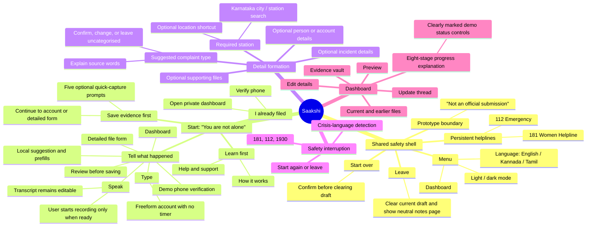

# Saakshi: product-flow and design rationale

## Purpose and boundary

Saakshi is a trauma-informed **file-preparation and private file-keeping prototype** for a person documenting online sexual abuse. It is not an official government portal and does not submit a complaint to one. That distinction is intentionally repeated in the prototype banner, the workflow page, the help page, the review step, and the dashboard.

The core job is not to make a person complete a form quickly. It is to help them turn a stressful, incomplete account into a reviewable record **without taking ownership away from them**. The product therefore favours optionality, plain language, editable suggestions, and clear safety exits over rigid completion.

This document records the intended happy paths, the role of each screen and component, and the design logic behind them. It reflects the current source and a live visual check on 3 September 2026. The live check deliberately did not request microphone or location access, upload a file, save a new case, or change a public case.

## Current visual evidence and review method

This revision was assembled from three independent reviews, then reconciled against the current source: (1) the filing flow and data-state rules, (2) dashboard, help, safety, and shared-navigation rules, and (3) a safe live visual capture. The visual capture was taken from the public prototype in light theme without entering a phone number, requesting a code, starting recording, using location, uploading files, saving a case, or changing public data.

| Evidence | What it verifies | Scope limit |
| --- | --- | --- |
| `docs/audit-evidence-2026-09-03/02-voice-entry-light.jpg` | Narrative-entry hierarchy, editability framing, and the persistent support shell | Captures the input screen; it does not test a microphone permission or transcription. |
| `docs/audit-evidence-2026-09-03/03-speak-idle-light.jpg` | Speak tab, idle state, and explicit recording trigger | Recording was intentionally not started. |
| `docs/audit-evidence-2026-09-03/04-evidence-first-light.jpg` | Five optional prompts, reasons, skip affordances, and non-blocking continuation | Does not include a real file selection or upload. |
| `docs/audit-evidence-2026-09-03/05-how-it-works-light.jpg` | The four-step expectation-setting surface | Informational page only. |
| `docs/audit-evidence-2026-09-03/06-help-support-light.jpg` | Prototype boundary, exit limitation, suggestion changeability, and help copy | Does not test a real phone call. |
| `docs/audit-evidence-2026-09-03/07-dashboard-verification-light.jpg` | The private-dashboard verification gate and demo framing | No number or OTP was entered; no saved-case state was accessed. |

The landing screen was intentionally excluded from this visual-evidence set: a fresh browser tab inherited an existing local draft and correctly opened the account step. Clearing it would have risked erasing user-local work, so it was not touched. The landing rationale in this document is instead based on the current route source and an earlier already-known structural review; it should be recaptured in a clean browser profile before a formal visual audit.

## Product principles

1. **Agency before automation.** The person writes or speaks in their own words, can edit every derived field, and must confirm a suggested complaint type before continuing.
2. **Progress without pressure.** Unknown details and missing evidence do not stop the journey; only the police-station selection is required before the pre-save review.
3. **Safety is always adjacent.** Emergency actions, an immediate exit, and an urgent-support path are available throughout the experience rather than buried at the end.
4. **Evidence is explained, not merely requested.** Each prompt says why that item may help, making collection feel purposeful rather than punitive.
5. **Honest boundaries build trust.** The prototype states what it does not do: no official filing, no automatic outreach, no erased browser history, and no claim that demo status is a real police tracker.
6. **A file stays living and legible.** The dashboard lets a person return to, correct, and extend their own record rather than treating filing as an opaque endpoint.

## Design philosophy: why the interface takes this shape

Saakshi is built around a specific ethical stance: **administrative structure should follow a person’s account, not replace it.** A conventional complaint form normally asks the institution’s questions first—category, evidence, time, address, then narrative. Saakshi reverses that logic. It starts with the lowest-demand question, “Tell us what happened,” and only progressively introduces structure when the person has enough context to understand why it is useful.

This produces five design rules that explain most placement decisions.

| Design rule | Philosophical rationale | Visible consequence |
| --- | --- | --- |
| **Begin with presence, not procedure** | A person may arrive frightened, ashamed, unsure whether their experience “counts,” or simply rushed. The product must first reduce isolation and decision pressure. | The landing headline and illustration appear before form controls; the primary action uses everyday language rather than “Create complaint.” |
| **Ask for the smallest next commitment** | In a high-stakes disclosure, a large form is not one task—it is many emotional and cognitive commitments. | Three start doors replace a single monolithic CTA; the primary door asks only for an account, while evidence and return paths are independent. |
| **Make every machine inference subordinate to the author** | Automated language can feel authoritative, particularly when it resembles legal classification. A person must remain the source of truth. | The app explains that a category is suggested, exposes its source words, allows edits, and requires confirmation before the suggestion can be used. |
| **Use optionality as care, not as vagueness** | “Unknown” is often the honest answer. A trauma-informed interface should not turn a lack of evidence into a failure to proceed. | Evidence, incident details, person details, and files are explicitly optional; the page says why an item helps rather than implying that it is mandatory. |
| **Put irreversibility behind a review** | Once a record is saved, a person may assume it has been acted upon. The interface must create an accuracy-and-boundary pause first. | Preview appears immediately before verification/save; its edit route is adjacent to the information being reviewed; “not submitted” is repeated. |

The information architecture therefore follows this rhythm:

```text
reassure → let the person choose a starting point → capture their account → offer structure → review together → save a private file → return and amend it
```

It deliberately avoids the opposite rhythm:

```text
categorise → demand proof → force completeness → imply official action
```

### Placement grammar: how to read the layout

The product uses **top-to-bottom disclosure** and **nearby explanation** as its spatial grammar.

| Layout decision | Why it is placed there | What it protects against |
| --- | --- | --- |
| Prototype banner above all navigation | It is seen before any branding, form, or CTA can be mistaken for an official service. | A user assuming they have made a government complaint. |
| Reassurance headline above the first action | Emotion and task framing are established before a decision is demanded. | A cold, bureaucratic first impression. |
| One primary start door followed by equal secondary doors | The most generally useful route has visual priority, but evidence urgency and returning users are not hidden. | Treating one disclosure sequence as universal. |
| Speak/Type controls directly above the shared editable field | The input method is a mode choice, not a fork into separate data or authority. | A voice transcript feeling final or different from typed words. |
| “Why this helps” beside each evidence prompt | The explanation is presented at the moment of effort, before the person decides to provide an item. | Evidence collection feeling arbitrary, accusatory, or impossible. |
| Required badge and reason at the start of station selection | The only structural gate is declared before optional questions begin. | Discovering a blocker only after completing a long form. |
| Optional incident and person sections after the station | The person first sees the minimum needed to make a reviewable file, then has space to enrich it. | Mistaking completeness for eligibility or feeling compelled to investigate. |
| Preview immediately before OTP/save | This is the last reversible checkpoint and should not be separated from the action it governs. | Saving a wrong inference, typo, or unwanted sensitive detail. |
| Dashboard’s current file before prior files | The most likely next task is the most recent record; history remains available without competing for attention. | A flat archive that makes the current action hard to find. |
| Progress explanation beside status, contact, and timing | “Status” becomes useful only when it answers what it means, who has it, and what comes next. | An opaque timeline or misleading percentage. |
| Help page states limitations before reassurance | Trustworthy help starts with what the prototype cannot do, then explains the choices it does preserve. | Calming copy that accidentally overpromises safety, privacy, or submission. |

### Copy philosophy

The most consequential words are intentionally non-adversarial:

- **“Tell what happened”** asks for an account, not a legal claim.
- **“Complete the details you know”** validates partial memory and avoids an instruction to be exhaustive.
- **“Saakshi fills what it can”** describes assistance as limited and fallible, rather than presenting a determination.
- **“Check your file before saving”** treats review as ownership, not as a compliance checkpoint.
- **“Leave”** is concise and direct; it offers an exit without asking the person to explain why.

This language should stay plain across English, Kannada, and Tamil. Any untranslated trust-critical copy would weaken the philosophy because the person most in need of clarity would receive the least of it.

## Mind map: intent, branches, and dependencies



## Happy paths

| Path | Journey | Why this sequence exists |
| --- | --- | --- |
| Main account-first path | Landing → **Tell what happened** → Speak or Type → complaint details → preview → demo verification → dashboard | Begins with the least formal task: telling the story. Structure is introduced only after the person has had a chance to express it in their own terms. |
| Voice variant | Account screen → **Speak** → ready state → person explicitly starts and stops recording → editable account text → details | Voice is an alternate input, not a separate workflow. The editable text area keeps the recorded account from becoming an unchallengeable transcript. |
| Evidence-first path | Landing → **Save evidence first** → five optional evidence prompts → account or details → preview → demo verification → dashboard | Gives a time-sensitive screenshot or link priority when content may disappear, without forcing a person to narrate before they are ready. |
| Return-to-file path | Landing → **I already filed** → phone/code gate → dashboard list → expand, preview, edit, or add evidence | A saved file is presented as something the person can continue to own and improve, not a one-way submission receipt. |
| Dashboard editing path | Dashboard → **Edit details** → edit form → edit preview → save changes → refreshed case | Preserves correction rights. The preview creates a final accuracy check before an existing record is changed. |
| Dashboard evidence path | Dashboard → **Edit details** → evidence vault → add a note or a supported file → view/download/remove item | Separates later-collected material from the original narrative so evidence can be added without rewriting the account. |
| Status-understanding path | Dashboard → expand a case → milestone rail / detailed stages / next-update explanation | Converts a vague “in progress” state into an understandable sequence. The current controls are explicitly a demo and must never be read as a live police integration. |
| Learn-before-action path | Landing → **How it works** or **Help and support** → read boundary and safety information → return to start | Lets a hesitant person orient themselves without committing to a form. This is especially important where the stakes and terminology are unfamiliar. |
| Safety exit path | Any screen → **Leave** → neutral notes page; or crisis language → crisis overlay → call, start again, or leave | The product treats stopping as a valid outcome. Urgent support interrupts document creation because immediate wellbeing may matter more than record completion. |

## Screen and component rationale

### 1. Shared shell: trust and escape before task completion

| Placement | What appears | Intention |
| --- | --- | --- |
| Top prototype banner | “Independent hackathon prototype · Nothing is submitted to the official portal” | Prevents a dangerous false assumption at the first possible moment. It is a trust boundary, not a legal footnote. |
| Header | Menu, Saakshi mark, Start over once a flow has begun, Leave | Makes orientation and exit options consistently discoverable. Start over is distinct from Leave: one restarts the preparation flow; the other abandons it quickly. |
| Menu | Dashboard, theme choice, language choice | Treats returning, readability, and language as primary utilities rather than hidden settings. English, Kannada, and Tamil reduce the pressure to use unfamiliar administrative language. |
| Footer | 181 Women Helpline and 112 Emergency | Keeps real-world support one tap away on every ordinary page. A phone link lets the person choose whether to call; Saakshi never contacts anyone on their behalf. |
| Light and dark themes | Same information architecture and actions in both modes | Theme is a comfort and accessibility preference, not a different product state. The flow and safety information must remain equivalent in either mode. |

Dark is the implementation default; light is an intentional user choice in the menu. The ethical rationale is not aesthetic novelty. People may be using the product privately at night, in a brightly lit public place, or alongside assistive display settings. Keeping the same order, labels, and decision points across themes means a preference change never changes the safety model. This still needs contrast and focus testing in both themes; visual equivalence is not proof of accessibility equivalence.

### 2. Landing: three legitimate starting points

The landing headline, “You are not alone,” establishes emotional safety before asking for information. The supporting copy promises an unhurried, user-owned account. Its visual illustration is not decoration alone: it softens an otherwise procedural opening and makes the page feel less like an official form.

| Door | What it communicates | Design reason |
| --- | --- | --- |
| **Tell what happened** | “Speak or type. Edit anything, whenever you want.” | The recommended route prioritises testimony in a person’s own language over a category-first taxonomy. |
| **Save evidence first** | “If a screenshot may disappear.” | Acknowledges the practical urgency of volatile online material and gives it an equal-status route. |
| **I already filed** | “Open a file kept on this phone.” | Makes the private file feel retrievable and ongoing rather than lost after a first session. |
| How it works / Help and support | Learn before disclosing | Creates an information-only route for someone who is not ready to start. |

### 3. Account screen: unstructured narrative before classification

The account screen uses the heading “Tell us what happened,” not legal terminology. Both Type and Speak feed the same editable account field. The voice tab intentionally starts in a calm **Ready when you are** state; recording is only initiated by the person. The app then presents any transcript as words they can change.

The sample complaint is a safe demonstration tool. It teaches the sequence without requiring someone to invent a disclosure, and its copy makes clear that it is fictional and changeable.

The progression rule—do not continue with an empty account—protects the usefulness of later suggestions while remaining gentle. The adjacent message explains the next step: Saakshi may suggest a type and prefill details, both editable. That expectation-setting prevents the assistive system from feeling like an opaque classifier.

### 4. Evidence-first screen: preserve what could disappear

The evidence-first route uses five general prompts, all optional:

- Screenshot with the URL visible
- Exact profile link
- Date and time first seen
- Witness
- Platform

Each has a reason next to it. For example, the URL helps identify an account after a post is deleted; the discovery time records what the person knows without asking them to guess when it was posted. The interface exposes **Continue without evidence**, because evidence capture should assist rather than gate access to support.

The later detail form can carry evidence-forward facts such as platform, profile, and first-seen time. This avoids duplicate work and signals that early effort was retained.

One wording issue to resolve in a future iteration: the progress display currently counts both saved and skipped prompts while saying “saved.” Relabelling it as “reviewed” would describe the state more honestly.

### 5. Complaint details: structured, but deliberately incomplete-friendly

This is the longest screen because it turns a personal account into a reusable record. Its sections are ordered by decision impact.

| Section | Why it is here | Why it is placed here |
| --- | --- | --- |
| Suggested complaint type | Maps the account to a person-readable category and exposes the reason/source words. The person can confirm, change it, or leave it uncategorised. | It appears before incident fields because its choice can inform relevant extra evidence prompts and prefills, but it is never silently accepted. |
| Police station (required) | Gives the prepared file a concrete local destination. City/district selection and station search reduce recall burden; location is an optional convenience. | It is the only preview requirement, so its requirement is made explicit early. Current coverage is honestly limited to Karnataka. |
| Incident details (optional) | Collects platform, identifier, media type, first-seen time, supporting file, and additional context. | It comes after the mandatory destination so a person can see which detail is truly needed and which can remain unknown. |
| Person or account involved (optional) | Allows identifiers, notes, and an identifying image/PDF only where personally known. | Placing it last reduces the feeling that a person must investigate or accuse someone beyond what they know. |
| Preview action / mobile completion bar | Shows the remaining required item and leads to review. | Keeps the long form navigable without falsely presenting optional fields as blockers. |

The local category helper is designed as a suggestion engine, not a decision-maker. It extracts likely facts from the narrative and may prefill platform, account identifier, media type, and time. A category suggestion must be confirmed before preview, which preserves the person’s authority and reduces the risk of an erroneous label becoming entrenched.

Files are constrained to supported image, video, audio, and PDF formats and a 10 MB maximum. This gives an understandable technical boundary while keeping the user-facing instruction focused on retaining the original when possible.

### 6. Preview and verification: an intentional pause before a saved file

The preview says “Check your file before saving.” It gathers the account, complaint type, service, identifier, first-seen time, supporting file, police station, carried evidence, and person details into one scannable record. The **Edit details** affordance keeps the review reversible.

This review matters because the journey converts emotionally difficult free text into structured data. Presenting it in one place allows a person to catch a wrong prefill, an unwanted detail, or a missing context before the app creates a case.

Verification is deliberately labelled as a demo. The documented demo code and seven-day device recognition support a prototype experience, but neither must be represented as real identity verification. Saving creates a private prototype file and then routes to the dashboard; it is not a complaint submission.

### 7. Dashboard: a living file, not a black box

The dashboard first verifies access, then lists the newest file before earlier files. This prioritises the record most likely to need attention while retaining history. The hero’s Demo badge and explanation are essential: any dates, stages, or progress indicators are illustrative rather than a real FIR or police-status tracker.

| Dashboard element | Intention |
| --- | --- |
| Reference, category, summary, saved date, service, police station | Reorients the person to the file without forcing them to re-read the entire narrative. |
| Inline preview | Lets someone inspect the structured record before choosing the more committed edit mode. |
| Edit details → edit preview → save | Keeps ownership of the record explicit and prevents accidental changes. |
| Evidence vault | Supports later additions of a note or file, and permits download/removal. It makes evidence management a first-class capability rather than an afterthought. |
| Update thread | Gives a human-readable place for staged updates in the prototype; it should not imply communication with an authority. |
| Four milestone rail and eight detailed stages | Gives both a quick mental model and a more precise explanation of progress. This tiering avoids making every visitor parse eight stages at a glance. |
| Named desk/contact and next-update timing | Makes status language more legible by answering “who has it?” and “what happens next?” rather than only showing a percentage. |
| Previous/Next status controls | Demonstrate the status model in a demo environment. They are useful for prototype exploration but are high-risk if their demonstration status is not unmistakable. |

The eight stages are: Complaint received; Preliminary assessment; FIR registered; Evidence collection; Technical / forensic review; Investigation in progress; Outcome being prepared; and Closed. The four milestone summary groups them into Complaint received, Assessment & registration, Evidence review, and Investigation & outcome.

### 8. How it works and Help: reduce uncertainty before disclosure

**How it works** intentionally uses four short cards: *Your words*, *What you have*, *Check the details*, and *Your file*. This page teaches the mental model in the same order as the main journey and ends in the primary call to action. It is not a policy page; it is a confidence-building preview.

**Help and support** answers the trust questions that can otherwise stop someone from starting:

- What happens if I leave quickly?
- Where do my words and later-added files go?
- Can I change a suggestion?
- Does the app contact someone or place a call for me?

The page explicitly says that Leave clears the current draft but cannot erase browser history. That is an important, candid limitation. It also repeats that post-save files remain in the prototype vault and are not sent to an official portal.

### 9. Crisis interruption: wellbeing outranks form completion

The flow detects a limited set of urgent signals in the account text (including references to suicide or a minor) and replaces the normal task with a crisis overlay. The overlay offers 181, 112, and 1930, plus Start again and Leave.

This interruption has a distinct product intent: it does not attempt to diagnose or solve a crisis. It makes immediate, user-initiated support easier to reach and removes the pressure to finish documenting first. Detection needs continual expert review because phrase matching can miss context or create false positives; it should be treated as an escalation cue, not a safety guarantee.

## Data, privacy, and representation rules

| Product claim | Current implementation/design implication |
| --- | --- |
| “Typing stays on this phone. Nothing is sent unless you choose.” | In-progress drafts are held in session storage; clearing or closing the relevant browser session affects availability. The UI should avoid implying permanent device storage. |
| “Files stay on this phone” before saving | File-selection prompts are designed as local preparation. The UI should keep the distinction between selected local material and any post-save vault upload precise. |
| “Private prototype vault” after saving | The dashboard’s evidence vault is a prototype storage experience, not an official evidence system or a guarantee of legal chain of custody. |
| “Not submitted to the official portal” | Must remain visible at every point where a person could reasonably infer submission: start, workflow, help, preview, verification, and dashboard. |
| “Real helplines” | The telephone links are real actions triggered by the person. Saakshi does not contact the helplines or emergency services for them. |
| “Status” | Dashboard stages and next-update information are demo content. No status widget may imply a real police case update without a verified integration. |

## Design opportunities for the next brainstorm

1. **Make demo controls even harder to misread.** Keep the Demo label adjacent to stage-change controls, or isolate those controls in a clearly titled prototype-simulation area.
2. **Clarify evidence progress.** Change “saved” to “reviewed” when skipped prompts count toward progress, and consider a visible “add later” reminder at preview.
3. **Strengthen permission expectation-setting.** Before a microphone or location request, give a one-line explanation of what will be requested and how declining affects the flow. The existing fallback paths already make this feasible.
4. **Recheck the station requirement.** It gives a file a destination, but it is also the only mandatory structured field and current geographic coverage is limited. Explore whether a saved draft can precede station selection for people not ready to choose one.
5. **Separate preparation from filing even more visually.** A small persistent “Prepared, not submitted” state marker on the preview and dashboard could protect against mistaken expectations.
6. **Test the category explanation with people, not only logic.** Showing source words supports transparency, but the wording must not feel accusatory or force a person into a legal category.
7. **Audit emergency and exit use under stress.** Test whether Leave, browser-history caveat, and phone actions remain obvious in both themes, on mobile, and with screen readers.

## Traceability: primary source areas

- Flow and progression rules: `domain/filing-machine.ts`
- Landing, input, evidence, detail, preview, and verification UI: `features/filing/filing-app.tsx`
- Evidence definitions, category suggestions, and file rules: `domain/catalog.ts`
- Draft lifecycle: `domain/draft.ts`
- Shared navigation, themes, languages, exit, and helplines: `features/chrome/sakshi-chrome.tsx`
- Dashboard, edit, evidence vault, and demo progress: `app/filed/page.tsx`, `domain/stages.ts`
- Learning/support pages: `app/workflow/page.tsx`, `app/whats-real/page.tsx`
- Crisis and leave states: `features/crisis/crisis-overlay.tsx`, `app/left/page.tsx`
- Current safe visual captures: `docs/audit-evidence-2026-09-03/`

## Reading this document

Use the mind map to discuss structure, the happy-path table to identify coverage, and the screen rationale to evaluate whether a proposed change still honours the product’s central promise: **the person stays in control of their words, their details, and their file.**
